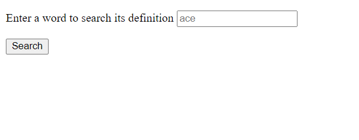
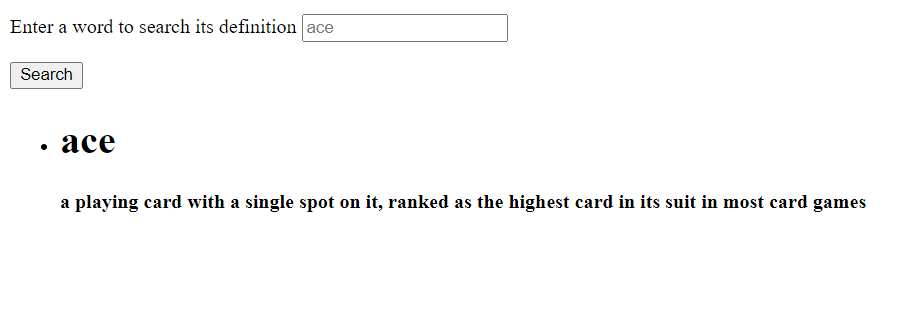
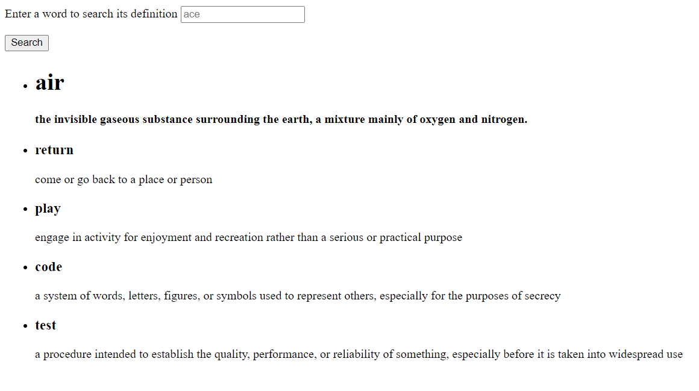
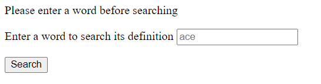
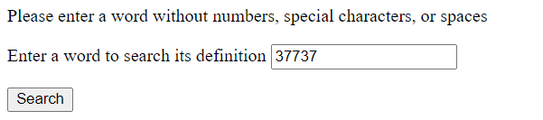
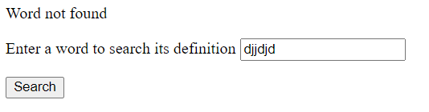
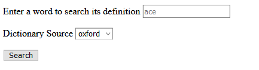

# Oxford Dictionary API Code Test

This small web app allows users to type in a word and receive the definition of that word according to the Oxford Dictionary.

The last five words defined are displayed on the bottom.

Any errors that occur are shown at the top of the page and are kept in a log file.

To run:
```
bundle install
rails server
```





Displays last five words defined


Displays error message based on user input






This was a fun little project to get reacquainted with Ruby and Rails. Since all of the data was coming from an external source and it did not need to persist beyond a session, I opted to use session variables to store the words instead of creating an entire model and database table. Also to keep it simple, I used one controller and only one view that gets updated as words are searched and defined. I would loved to have used a frontend framework to make it look nice too, but that wasn't part of the requirements and I did not want to overextend myself for a simple code test. Thank you so much for the opportunity. I look forward to discussing my decisions further in an interview. 


-----UPDATE------


Added dropbox for users to select the source they wish to define a word from


If dictionary source needs to be added:
1) Create a class in ```services/dictionaries``` for the source including the headers, and methods for generating a url, generating a user friendly error message, and parsing the response from the server. See ```dictionaries/oxford.rb``` for example.
2) Require the class in ```services/dictionary.rb``` and add the name of the source to the list of sources at the top